# E-Commerce Sales Analysis

## 1. Project Overview

This project presents an exploratory analysis of an e-commerce sales dataset using Microsoft Excel and Python.

The analysis focuses on data preparation, sales performance, customer characteristics, product categories, sales channels, order status, geographical distribution, and key business performance indicators.

The project combines Excel-based PivotTable analysis with Python-based Exploratory Data Analysis (EDA) and data visualization.

---

## 2. Objectives

The primary objectives of this project are:

- To understand the structure and characteristics of the e-commerce dataset.
- To clean and preprocess the available data.
- To analyze monthly sales and order trends.
- To evaluate sales performance by gender and age group.
- To identify the top-performing states.
- To analyze order status distribution.
- To compare sales performance across different channels.
- To analyze product category performance.
- To calculate key business performance indicators.
- To perform exploratory data analysis using Python.
- To generate visualizations for effective interpretation of the results.
- To derive meaningful business insights from the analysis.

---

## 3. Project Architecture

The project follows a structured data analysis workflow that combines Microsoft Excel and Python for data processing, analysis, and visualization.

```text
                    E-Commerce Sales Dataset
                              │
                              ▼
                    Microsoft Excel Workbook
                              │
                              ▼
                    Data Processing Sheet
                              │
                              ▼
                    Python EDA Script
                  (ecommerce_excel_eda.py)
                              │
                ┌─────────────┴─────────────┐
                ▼                           ▼
          Data Cleaning              Feature Engineering
                │                           │
                ├── Missing Values         ├── Year
                ├── Duplicates             ├── Month
                ├── Data Types             ├── Month Number
                ├── Categories             └── Weekday
                └── Spelling Corrections
                │
                ▼
             Clean Dataset
                │
                ▼
          Exploratory Data Analysis
                │
       ┌────────┼──────────┐
       ▼        ▼          ▼
      KPIs   Summary      Statistical
             Tables       Analysis
       │        │          │
       ▼        ▼          ▼
    KPI CSVs  Summary     Correlation
              CSVs        Analysis
                │
                ▼
          Data Visualizations
                │
       ┌────────┼──────────┐
       ▼        ▼          ▼
    Revenue   Customer   Geographic
     Trends    Analysis    Analysis
       │        │          │
       └────────┼──────────┘
                ▼
          Business Insights
                │
                ▼
             GitHub
      Code + Results + README
```

### Architecture Components

**1. Data Source**

The project uses an e-commerce sales dataset stored in an Excel workbook. The Python script reads the `data processing` worksheet as the primary input.

**2. Data Processing**

The Python script loads the dataset and performs data cleaning operations such as data type conversion, missing-value handling, duplicate removal, categorical standardization, and correction of known spelling variations.

**3. Feature Engineering**

Additional features such as Year, Month Number, Month Name, and Weekday are generated from the available date information.

**4. Exploratory Data Analysis**

The cleaned dataset is analyzed to understand sales trends, product categories, sales channels, customer characteristics, order status, geographical performance, and other business-related patterns.

**5. KPI and Summary Generation**

Key performance indicators and grouped summary tables are calculated and exported as CSV files for further analysis and reporting.

**6. Data Visualization**

Python libraries such as Matplotlib and Seaborn are used to generate charts including revenue trends, order trends, category analysis, channel analysis, state-wise sales, order status, quantity distribution, correlation analysis, and Pareto analysis.

**7. Business Insights**

The results of the analysis are used to identify important patterns and provide meaningful insights into e-commerce sales performance.

**8. GitHub Repository**

The final repository contains the Python source code, aggregated analysis tables, visualizations, and project documentation in the README file.

---

## 4. Tools and Technologies

| Tool / Technology | Purpose |
|---|---|
| Microsoft Excel | Data analysis, PivotTables and charts |
| Python | Data processing and exploratory analysis |
| Pandas | Data manipulation and analysis |
| NumPy | Numerical operations |
| Matplotlib | Data visualization |
| Seaborn | Statistical visualization |
| OpenPyXL | Excel file handling |
| GitHub | Project version control and documentation |

---

## 5. Dataset

The analysis is based on an e-commerce sales dataset containing **31,047 records and 21 columns** after processing.

The dataset contains information related to:

- Order ID
- Customer ID
- Gender
- Age
- Age Group
- Date
- Month
- Order Status
- Sales Channel
- SKU
- Category
- Size
- Quantity
- Amount
- City
- State
- Postal Code
- Country
- B2B transactions

The original dataset is not included in this public repository because it contains customer- and order-level information.

---

## 6. Excel Analysis

The Excel workbook was used to perform PivotTable-based analysis and generate charts for six major business questions.

### Q1. Monthly Sales and Orders

Monthly revenue and order volume were analyzed to identify sales trends throughout the year.

| Month | Sales Amount (₹) | Order Count |
|---|---:|---:|
| January | 1,820,601 | 2,702 |
| February | 1,875,932 | 2,750 |
| March | 1,928,066 | 2,819 |
| April | 1,829,263 | 2,685 |
| May | 1,797,822 | 2,617 |
| June | 1,750,966 | 2,597 |
| July | 1,772,300 | 2,579 |
| August | 1,808,505 | 2,617 |
| September | 1,688,871 | 2,490 |
| October | 1,666,662 | 2,424 |
| November | 1,615,356 | 2,383 |
| December | 1,622,033 | 2,384 |
| **Grand Total** | **21,176,377** | **31,047** |

**Result:** March recorded the highest monthly revenue and order count, while November recorded the lowest monthly revenue and order count.

---

### Q2. Sales by Gender

Total sales revenue was compared between male and female customers.

| Gender | Sales Amount (₹) |
|---|---:|
| Men | 7,613,604 |
| Women | 13,562,773 |
| **Total** | **21,176,377** |

**Result:** Female customers contributed a larger proportion of the total revenue.

---

### Q3. Order Status

Orders were analyzed according to their status.

| Order Status | Order Count |
|---|---:|
| Cancelled | 844 |
| Delivered | 28,641 |
| Refunded | 517 |
| Returned | 1,045 |
| **Total** | **31,047** |

**Result:** Delivered orders represented the majority of the transactions.

---

### Q4. Top 10 States by Sales

The top-performing states were identified based on total sales revenue.

| Rank | State | Sales Amount (₹) |
|---:|---|---:|
| 1 | Maharashtra | 3,001,779 |
| 2 | Karnataka | 2,645,078 |
| 3 | Uttar Pradesh | 2,104,133 |
| 4 | Telangana | 1,718,226 |
| 5 | Tamil Nadu | 1,678,212 |
| 6 | Delhi | 1,264,734 |
| 7 | Kerala | 1,008,176 |
| 8 | West Bengal | 921,202 |
| 9 | Andhra Pradesh | 910,862 |
| 10 | Haryana | 812,063 |

**Result:** Maharashtra recorded the highest sales among the top 10 states, followed by Karnataka and Uttar Pradesh.

---

### Q5. Age Group and Gender Sales

Sales were analyzed across different age groups and genders to identify customer purchasing patterns.

The PivotTable compares sales amounts across age groups and gender categories.

**Analysis:** This analysis helps identify which customer age groups contribute more to sales and whether purchasing patterns differ between male and female customers.

---

### Q6. Sales by Channel

Sales revenue was analyzed across different sales channels to compare their performance.

The PivotTable summarizes total sales according to the available sales channels.

**Analysis:** This comparison helps identify the sales channels that contribute most significantly to overall revenue.

---

## 7. Python Exploratory Data Analysis

Python was used for data loading, data cleaning, feature engineering, KPI calculation, summary analysis, and visualization.

### 7.1 Data Processing

The Python script reads the `data processing` worksheet from the Excel workbook.

The processing workflow includes:

- Loading the Excel dataset.
- Standardizing column names.
- Converting columns to appropriate data types.
- Handling missing values.
- Removing duplicate records.
- Standardizing categorical values.
- Correcting known spelling variations.
- Processing date information.

Additional time-based features are created, including:

- Year
- Month Number
- Month Name
- Weekday

---

## 8. Key Performance Indicators

| Metric | Value |
|---|---:|
| Total Revenue | ₹21,176,377 |
| Unique Orders | 28,471 |
| Unique Customers | 28,437 |
| Units Sold | 31,237 |
| Average Order Value | ₹743.79 |

---

## 9. Python Visualizations

The Python analysis generated the following visualizations.

### 9.1 Monthly Revenue Trend

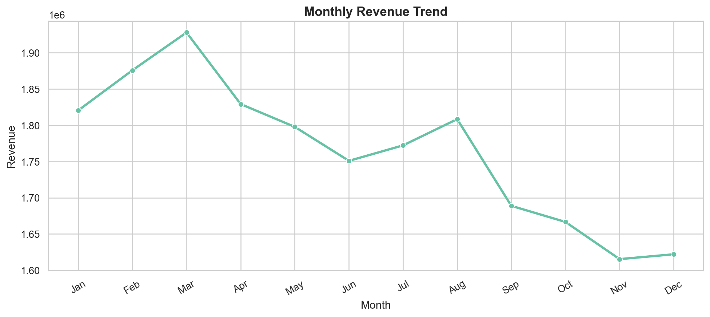

### 9.2 Monthly Orders

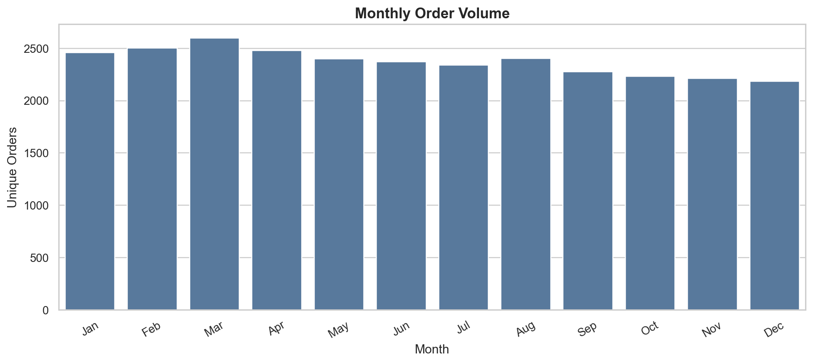

### 9.3 Category Revenue

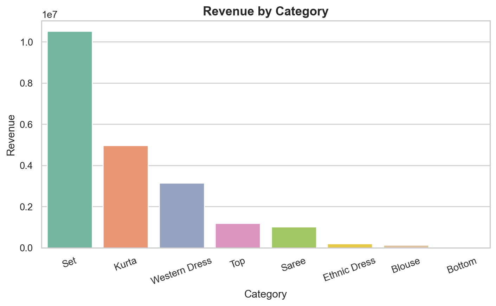

### 9.4 Channel Revenue

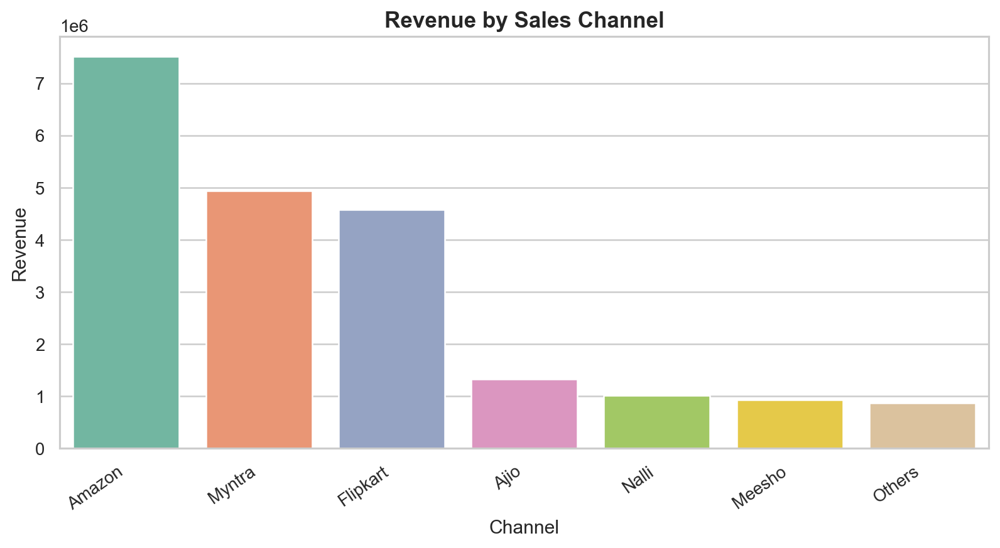

### 9.5 Age Group and Gender Revenue

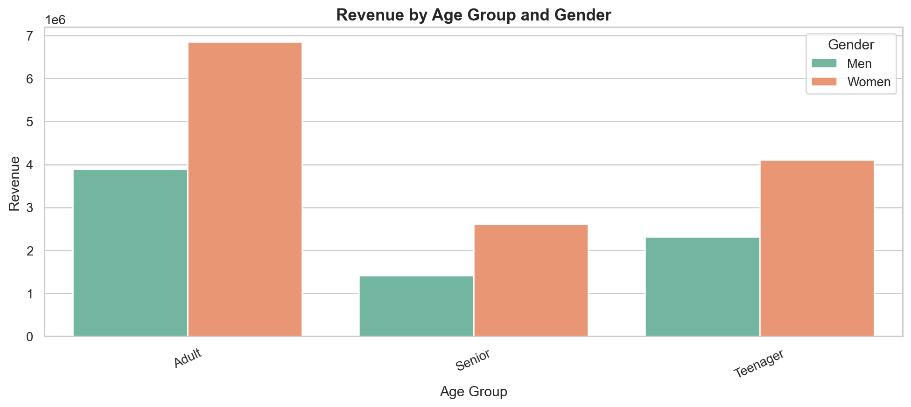

### 9.6 Top 10 States by Revenue

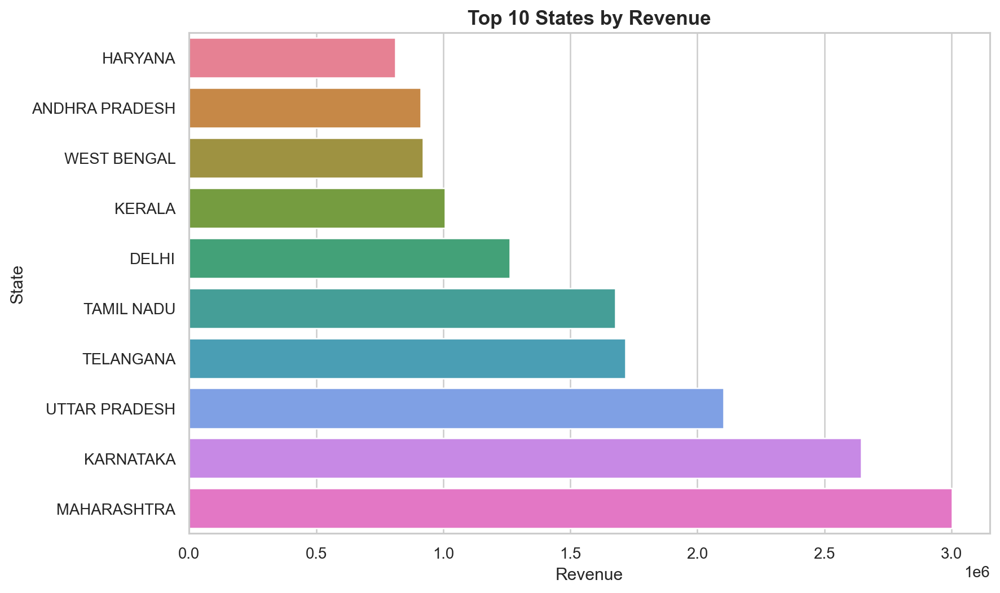

### 9.7 Order Status

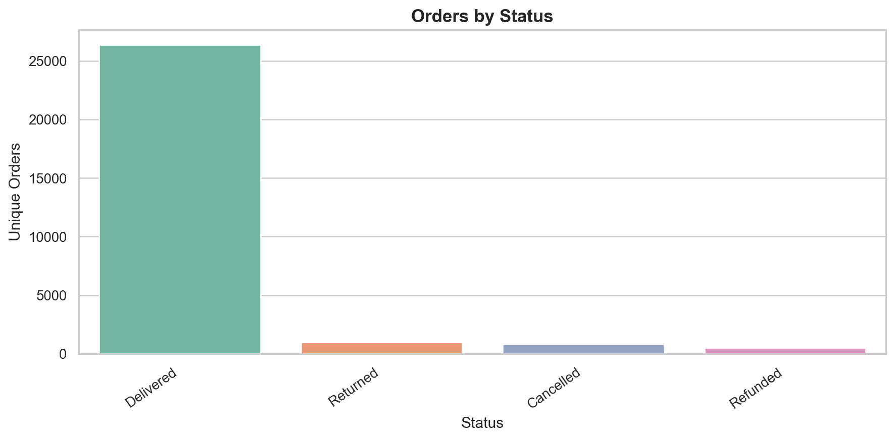

### 9.8 Quantity Distribution

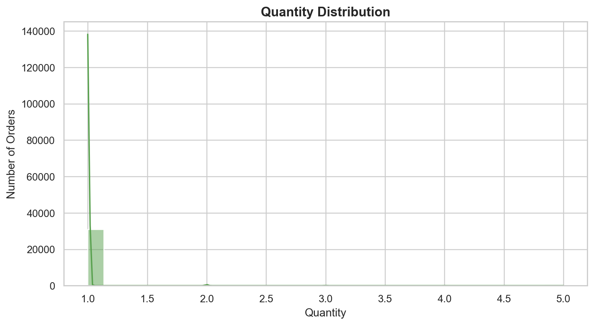

### 9.9 Order Amount Distribution and Outliers

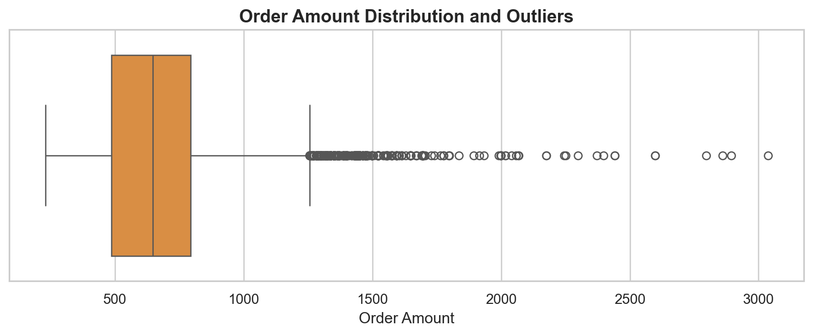

### 9.10 B2B Revenue

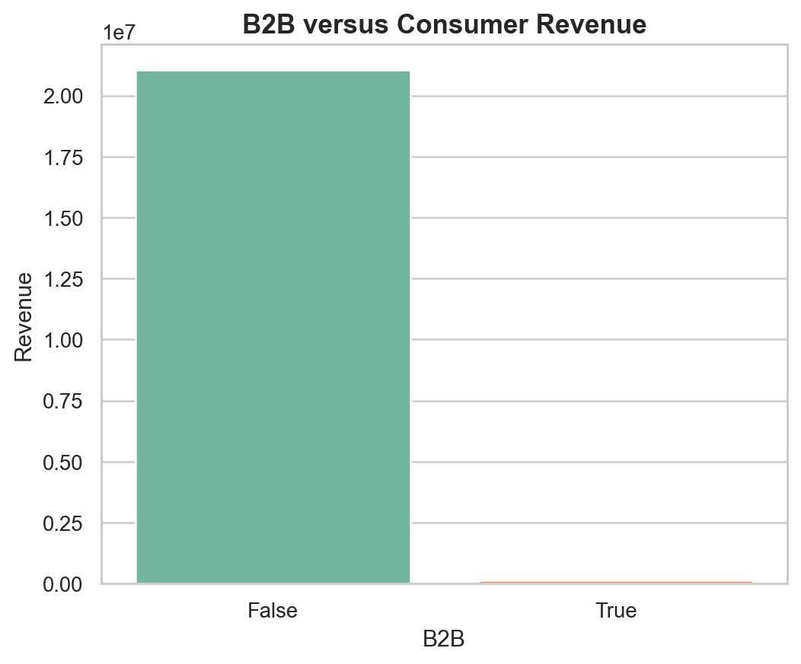

### 9.11 Correlation Heatmap

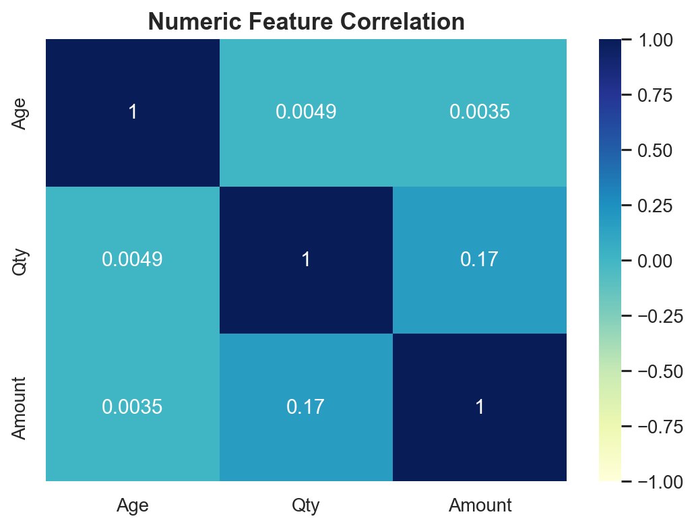

### 9.12 Category Pareto Analysis

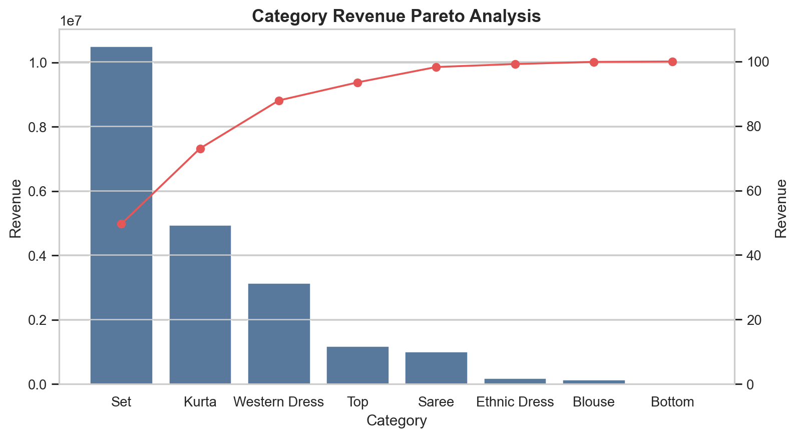

---

## 10. Key Findings

The analysis resulted in the following observations:

- Total revenue generated was **₹21,176,377**.
- The calculated average order value was approximately **₹743.79**.
- March recorded the highest monthly revenue.
- November recorded the lowest monthly revenue.
- Female customers generated a larger share of the total revenue.
- Maharashtra was the highest-performing state among the analyzed states.
- Delivered orders accounted for the majority of the transactions.
- Sales performance varies across product categories and sales channels.
- Customer age group and gender provide useful perspectives on purchasing behaviour.
- B2B and non-B2B revenue were analyzed separately to understand their contribution to overall sales.

---

## 11. Project Structure

```text
Ecommerce_EDA/
│
├── ecommerce_excel_eda.py
├── README.md
├── .gitignore
│
├── eda_summary_tables/
│   ├── kpis.csv
│   ├── monthly_summary.csv
│   ├── category_summary.csv
│   ├── channel_summary.csv
│   └── state_summary.csv
│
└── visualizations/
    ├── 01_monthly_revenue_trend.png
    ├── 02_monthly_orders.png
    ├── 03_category_revenue.png
    ├── 04_channel_revenue.png
    ├── 05_age_gender_revenue.png
    ├── 06_top_states_revenue.png
    ├── 07_order_status.png
    ├── 08_quantity_distribution.png
    ├── 09_amount_outliers.png
    ├── 10_b2b_revenue.png
    ├── 11_correlation_heatmap.png
    └── 12_category_pareto.png
```

---

## 12. Python Execution Output

The Python EDA script was executed successfully and generated the analysis results and visualizations shown below.


### 12.1 Monthly Revenue Trend


### 12.2 Monthly Orders


### 12.3 Category Revenue


### 12.4 Channel Revenue


### 12.5 Age Group and Gender Revenue


### 12.6 Top 10 States by Revenue


### 12.7 Order Status


### 12.8 Quantity Distribution


### 12.9 Order Amount Distribution and Outliers


### 12.10 B2B Revenue


### 12.11 Correlation Heatmap


### 12.12 Category Pareto Analysis


---

## 13. Execution

### Requirements

Install the required Python libraries:

```bash
pip install pandas numpy matplotlib seaborn openpyxl
```

### Dataset Setup

The Python script expects the Excel dataset at:

```text
upload/sales_data.xlsx
```

The workbook should contain the required:

```text
data processing
```

worksheet.

### Run the Analysis

Execute the following command:

```bash
python ecommerce_excel_eda.py
```

The script generates the analysis summary tables and visualization files.

---

## 14. Data Privacy

The original customer-level dataset is not included in this public repository.

The repository contains the analysis code, aggregated summary tables, generated visualizations, and project documentation.

---

## 15. Conclusion

This project demonstrates an end-to-end approach to e-commerce sales analysis using Excel and Python.

Excel PivotTables were used to perform business-oriented analysis, while Python was used for data processing, exploratory analysis, KPI calculation, and visualization.

The combined analysis provides insights into sales trends, customer characteristics, product categories, sales channels, order status, and geographical sales performance.
